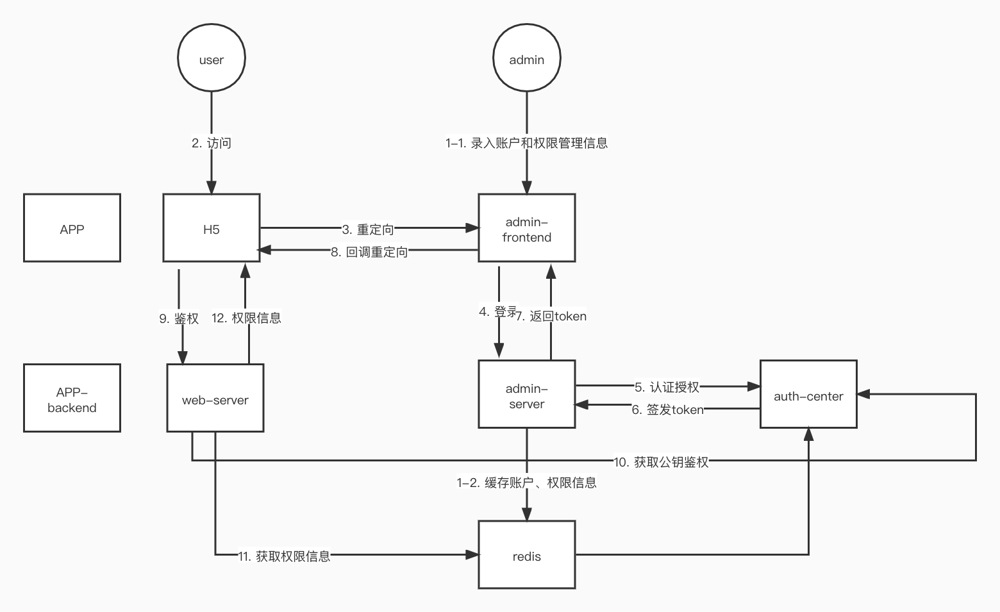

# 一种基于Oauth2的认证授权中心的实现

[TOC]

> 业内在用户统一身份认证及授权管理领域，主要关注 4 个方面：集中账号管理（Account）、集中认证管理（Authentication）、集中授权管理（Authorization）和集中审计管理（Audit）， 简称 4A 管理。

## 概念与原理

### Oauth2概念

1. 角色
   - 客户端 Client：用户
   - 资源 Resource：菜单、url
   - 资源所有者 Resource Owner : 浏览器
   - 资源服务器 Resource Server：应用程序
   - 授权服务器 Authentication Server

### 权限流程

认证 -> 授权 -> 鉴权 -> 权限管理

### 单点登录

1. 传统的多点登录系统中，每个站点都实现了本站专用的帐号数据库和登录模块。各站点的登录状态相互不认可，各站点需要逐一手工登录。
2. 单点登录，英文是 Single Sign On，缩写为 SSO。多个站点(192.168.1.20X)共用一台认证授权服务器(192.168.1.110，用户数据库和认证授权模块共用)。用户经由其中任何一个站点(比如 192.168.1.201)登录后，可以免登录访问其他所有站点。而且，各站点间可以通过该登录状态直接交互。
3. 单点登录（SSO）技术在本系统中并不适用，多个应用之前没有可以跳转的能力。无法实现一次登录，全部访问。它的本质是重定向。无论何种应用是否采用 SSO，系统在技术上应当具备 SSO 的能力。

### 鉴权的几种方案

token VS session

## 产品设计

### 模块划分

- 认证授权中心
- 账号、权限管理中心（与上一个模块拆分，职责更清晰，有利于微服务化）
- 应用程序

## 技术方案

### 整体解决方案

1. Oauth2 + jwt，采用密码授权模式。
2. 基于RBAC的权限模型。

### 解决过期时间问题

1. 过期过于频繁

   TODO refresh token和access token 

2. token不失效

   TODO 无法根本解决。

### 回调与重定向

参考github sso

### 网关层的鉴权

在微服务中适合在网关层鉴权，之后会进行重构。

TODO 这个方案意味着所有请求都通过网关，从而有效地隐藏了微服务。在请求时，网关将原始用户令牌转换为内部会话 ID 令牌。在这种情况下，注销就不是问题，因为网关可以在注销时撤销用户的令牌。

### *client_secret 机制*

## token 加密

到底加到了什么程度？base64 还是可以进一步enhance？

关于 Token 注销：

Token 的注销，由于 Token 不存储在服务端，由客户端存储，当用户注销时，Token 的有效时间还没有到，还是有效的。所以如何在用户注销登录时让 Token 注销是一个要关注的点。一般有如下几种方式：

Token 存储在 Cookie 中，这样客户端注销时，自然可以清空掉
注销时，将 Token 存放到分布式缓存中，每次校验 Token 时区检查下该 Token 是否已注销。不过这样也就失去了快速校验 Token 的优点。
多采用短期令牌，比如令牌有效期是 20 分钟，这样可以一定程度上降低注销后 Token 可用性的风险。

## 工作流程

1. 在统一后台系统配置好，创建用户账号，客户端信息，以及相应的角色和资源。提供crud功能。

   TODO 补充描述

## 其他待整理

https://learnku.com/articles/30704

https://www.cnblogs.com/fengzheng/p/11724625.html

https://www.cnblogs.com/haoxianrui/p/13719356.html

https://mrbird.cc/Spring-Security-OAuth2-Guide.html

https://cloud.tencent.com/developer/article/1472755

 token 失效相关

https://www.cnblogs.com/dudu/p/oauth-refresh-token.html

https://segmentfault.com/a/1190000021867342

https://www.geekjc.com/post/5c2d9287510938156d40e0e1

https://www.jianshu.com/p/2f8b6591a09d

https://blog.csdn.net/weixin_42970433/article/details/103170301

https://segmentfault.com/q/1010000010043871

## 总结

1. 自己要实现鉴权管理器。后端要自己实现鉴权（java可以用框架 c++自己实现）和权限管理。如果有网关则在网关层实现，不应该每次请求都要去认证中心去鉴权。
2. 鉴权前一次性访问认证中心公钥即可。认证服务器使用私钥加签，资源服务器使用公钥验签，默认算法RSA  资源服务器会去到认证服务器拿公钥，用于验签。
3. 场景不适合单点登录。
4. 单独一个项目维护各个应用程序的的权限管理信息和账户信息。然后这个项目时把角色权限表维护在业务数据库里，用的时候缓存到redis。
5. 目前这个系统是 一边维护 用户和角色  业务系统 维护 角色和权限。 理论上可以在一起维护，要确认产品设计上是否有必要。反正都是可以读库和缓存到redis的。实际上c++端只需要实现一个根据url找到对应的角色，然后根据token结果，判断是否通行的方法就可以了。有框架可能是现成的而已。

## Reference

1. 微服务架构下的统一身份认证和授权 https://cloud.tencent.com/developer/article/1753987
2. 大白话唠唠 Oauth2 与授权认证的那些事儿！http://www.modb.pro/db/41264 
3. 认证、授权、鉴权和权限控制 https://xie.infoq.cn/article/52615f4a57933d2e8dfe84f2d 
4. 微服务架构下的鉴权，怎么做更优雅？https://learnku.com/articles/30704
5. OAuth2授权 https://www.cnblogs.com/linianhui/p/oauth2-authorization.html#auto-id-18